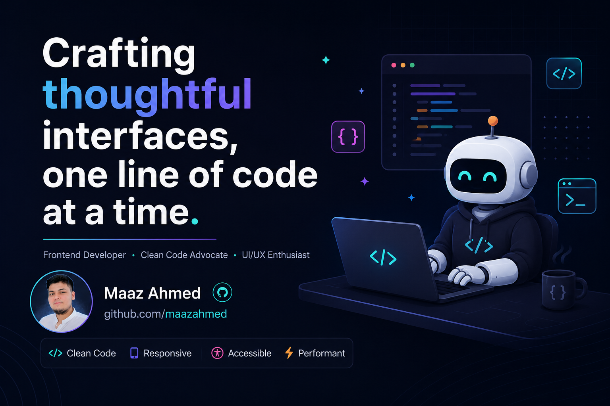

<!-- ========================= BANNER ========================= -->

  

<h1 align="center">Hi 👋, I'm Maaz Ahmed</h1>

<h3 align="center">
Frontend Developer • MERN Stack Learner • Open to Internship Opportunities
</h3>

---

# 👨‍💻 About Me

💻 Passionate Frontend Developer

🚀 Currently learning MERN Stack

🎯 Goal → Become a Professional Full Stack Developer

📍 Pakistan

---

<!-- ========================= SHOWCASE IMAGE ========================= -->

  

---

# 🌐 Connect With Me

---

# ⚒️ Tech Stack

---

# 📊 GitHub Stats

---

<h3 align="center">

💙 Thanks for visiting my profile 💙

</h3>
